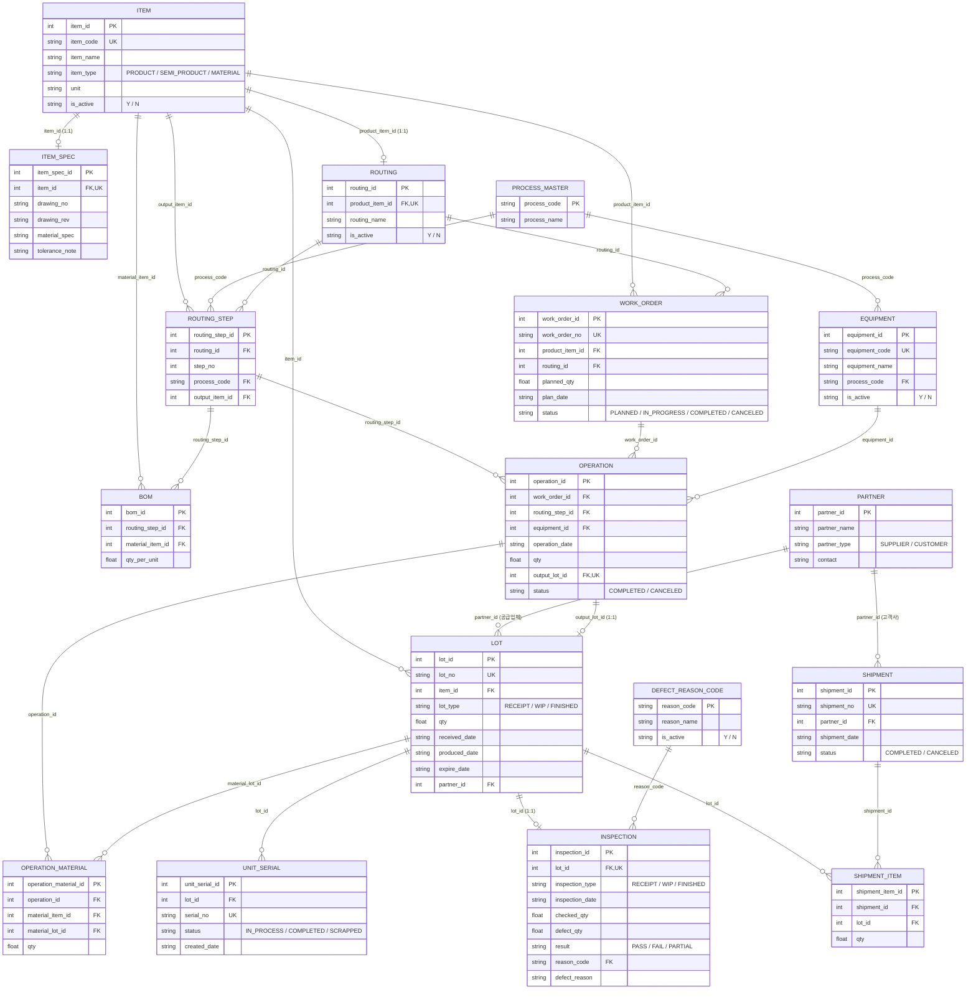

# Auto Parts MES 발표

---

## 1. 개요

Auto Parts MES는 자동차부품 제조 공정을 관리하는 생산관리시스템(MES)이다. 이전에 만든 "라면공장 Mini MES"의 핵심 구조(품목-LOT-생산-검사-출하)를 재사용하되, 자동차부품 업종 특성에 맞춰 **다단계 공정(라우팅) 관리**와 **개별 부품 시리얼 추적**을 추가로 구현했다.

---

## 2. 문제 제기 / 만든 이유

자동차부품은 라면 같은 단일 공정 제품과 달리, 실무에서 이런 요구사항이 추가로 필요하다.

- "이 부품은 프레스 → 용접 → 도장을 거치는데, 지금 어느 단계까지 진행됐지?"
- "이 원자재 로트에 문제가 생겼는데, 어떤 완제품(그리고 그중 몇 번 시리얼)까지 영향을 미쳤지?"
- "이 도면번호/재질규격에 맞게 만들어졌는지 스펙을 어디서 확인하지?"
- "완성차 업체가 특정 부품 하나의 이력(전 공정, 전 원자재)을 요구하면 어떻게 답하지?"

단일 공정 구조로는 이런 질문에 답할 수 없어서, 공정 순서(라우팅)와 개별 시리얼 추적이 가능한 구조로 새로 설계했다.

---

## 3. 시스템 구조

**기술 스택**

- 프론트엔드/전체 앱: Python + Streamlit
- 데이터베이스: SQLite
- 인증: 아이디/비밀번호 해시(SHA-256) 기반 로그인, 역할별(ADMIN/OPERATOR/INSPECTOR) 화면 접근 제한

**핵심 데이터 흐름**

```
품목/거래처/공정/설비 등록 → 라우팅·BOM 설계 → 원자재 입고
    → 작업지시 → 공정 실행(단계별 반복) → 검사 → 개별 시리얼 부여 → 출하 → LOT 추적
```

라면 MES와의 가장 큰 차이는 "생산"이 한 번에 끝나지 않고, **공정 단계 수만큼 반복**된다는 점이다.

### 3-1. 데이터 모델 (ERD)



### 3-2. 역할별 접근 권한

| 페이지 | ADMIN | OPERATOR | INSPECTOR |
|---|:---:|:---:|:---:|
| 품목 관리 | ✅ | ✅ | ✅ (조회 위주) |
| 거래처 관리 | ✅ | ✅ | ❌ |
| 공정/설비 관리 | ✅ | ✅ | ❌ |
| 라우팅/BOM 관리 | ✅ | ✅ | ❌ |
| 원자재 입고 | ✅ | ✅ | ❌ |
| 작업지시 | ✅ | ✅ | ❌ |
| 공정 실행 | ✅ | ✅ | ❌ |
| 검사 관리 | ✅ | ❌ | ✅ |
| 개별 시리얼 관리 | ✅ | ✅ | ✅ |
| 출하 관리 | ✅ | ✅ | ❌ |
| LOT 추적 | ✅ | ✅ | ✅ |
| 사용자 관리 | ✅ | ❌ | ❌ |

---

## 4. 라이브 데모 순서


### (1) 로그인

)

- 역할(ADMIN/OPERATOR/INSPECTOR)에 따라 로그인 배너 색상과 접근 가능한 메뉴가 달라진다.

### (2) 품목 관리


- 완제품(PRODUCT)/반제품(SEMI_PRODUCT)/원자재(MATERIAL) 등록, 도면번호·개정·재질규격·공차 정보까지 함께 입력.

### (3) 거래처 관리


- 공급업체(SUPPLIER)/고객사(CUSTOMER) 등록. 이후 입고·출하 시 연결된다.

### (4) 공정/설비 관리


- 프레스, 용접, 도장 같은 공정 종류와 각 공정에 속한 설비를 등록.

### (5) 라우팅 / BOM 관리 


- 제품이 거칠 공정 순서를 단계별로 등록하고(예: 1.프레스→2.용접→3.도장), 각 단계마다 필요한 원자재/반제품을 BOM으로 연결.
- "라면공장 MES는 원자재 투입 한 번으로 완제품이 나왔지만, 여기는 공정마다 반제품이 생기고 그게 다음 공정의 원료가 됩니다."

### (6) 원자재 입고


- 공급업체 정보와 함께 원자재 LOT 등록.

### (7) 작업지시


- 라우팅이 등록된 제품만 작업지시를 낼 수 있다. "이 제품을 몇 개 만들자"는 계획 단위.

### (8) 공정 실행 


- 작업지시를 고르면 **다음에 실행해야 할 단계가 자동으로 계산**되어 표시된다. 단계를 건너뛰려고 하면 시스템이 막는다.
- 원자재는 입고 LOT에서, 2단계부터는 **이전 단계가 만든 반제품 LOT에서** 선택한다.
- "생산이 한 번에 안 끝나고, 공정 단계 수만큼 이 화면을 반복해서 씁니다."

### (9) 검사 관리


- 원자재 입고(RECEIPT), 반제품(WIP), 완제품(FINISHED) 세 종류 검사 모두 지원.

### (10) 개별 시리얼 관리 


- LOT 하나를 골라 그 안의 부품 하나하나에 시리얼번호를 부여. "LOT 단위로 부족하고 개별 부품 추적이 필요한 안전부품 등에 활용."

### (11) 출하 관리


- 완제품 LOT만 대상, 고객사 연결. 불합격(FAIL) 판정된 LOT는 자동으로 출하가 막힌다.

### (12) LOT 추적 


- 원자재 LOT 하나를 정방향 추적하면, 프레스→용접→도장을 거쳐 어떤 완제품이 됐고 어디로 출하됐는지 **한 번에** 나온다.
- SQLite의 재귀 쿼리(`WITH RECURSIVE`)로 구현해서, 공정 단계가 몇 개든 자동으로 끝까지 따라간다.

### (13) 홈 대시보드


- 작업지시별 진행률(몇 단계 중 몇 단계 완료), 원자재 재고 알림, 최근 활동(입고/공정실행/출하) 타임라인.


---

## 5. 마무리 / 확장 가능성

이 구조는 라면공장 MES에서 시작해, 다단계 공정과 개별 시리얼 추적이 필요한 업종(자동차부품, 전자부품 등)에 맞게 확장한 결과다. 반대로 라우팅이 항상 1단계인 업종에서는 라면 MES 쪽 구조가 더 단순하고 적합하다 — 즉 업종 특성에 따라 두 구조 중 선택하거나, 필요할 때 라우팅을 도입하는 식으로 점진적으로 전환할 수 있다.

---

## 6. Q&A

| Q | A |
|---|---|
| 왜 SQLite를 썼나요? | 소규모 시스템이라 별도 서버 없이 파일 하나로 관리 가능해서. 실제 운영 규모라면 PostgreSQL 등으로 전환 가능. |
| 라면공장 MES와 가장 큰 차이는 뭔가요? | 생산이 한 번에 끝나지 않고 공정 단계(라우팅) 수만큼 반복되는 것. 그래서 `production` 테이블 하나였던 게 `routing`/`routing_step`/`work_order`/`operation` 네 개로 나뉘었습니다. |
| 라우팅을 제품당 1개로 제한한 이유는? | 관리 복잡도를 낮추기 위한 선택입니다. 여러 버전(구공정/신공정)을 동시에 관리해야 하면 나중에 라우팅에 버전 개념을 추가할 수 있습니다. |
| BOM이 제품이 아니라 공정 단계에 연결된 이유는? | 원자재가 "제품 전체"가 아니라 "몇 번째 공정에서" 투입되는지가 중요해서입니다. 1단계에서 강판이 들어가고 3단계에서 도료가 들어가는 식으로 공정별로 다릅니다. |
| 개별 시리얼은 왜 필요한가요? | LOT 단위 추적으로는 부족한 안전부품 등에서, 완성차 업체가 부품 하나하나의 이력을 요구하는 경우가 있어 대비했습니다. |
| LOT 추적이 재귀 쿼리인 이유는? | 공정 단계 수가 제품마다 다를 수 있어서, 몇 단계든 자동으로 끝까지 따라가려면 SQL의 `WITH RECURSIVE` 재귀 쿼리가 필요합니다. |
| 불합격(FAIL) LOT는 어떻게 막나요? | 출하 등록 시 선택한 LOT의 검사 결과를 서버(백엔드) 단에서 다시 확인해, FAIL이면 저장 자체를 막습니다. |
| 보안은 어떻게 처리했나요? | 비밀번호는 평문 저장 없이 솔트+SHA-256 해시로 저장하고, 역할(ADMIN/OPERATOR/INSPECTOR)에 따라 페이지 접근을 제한합니다. |

---
