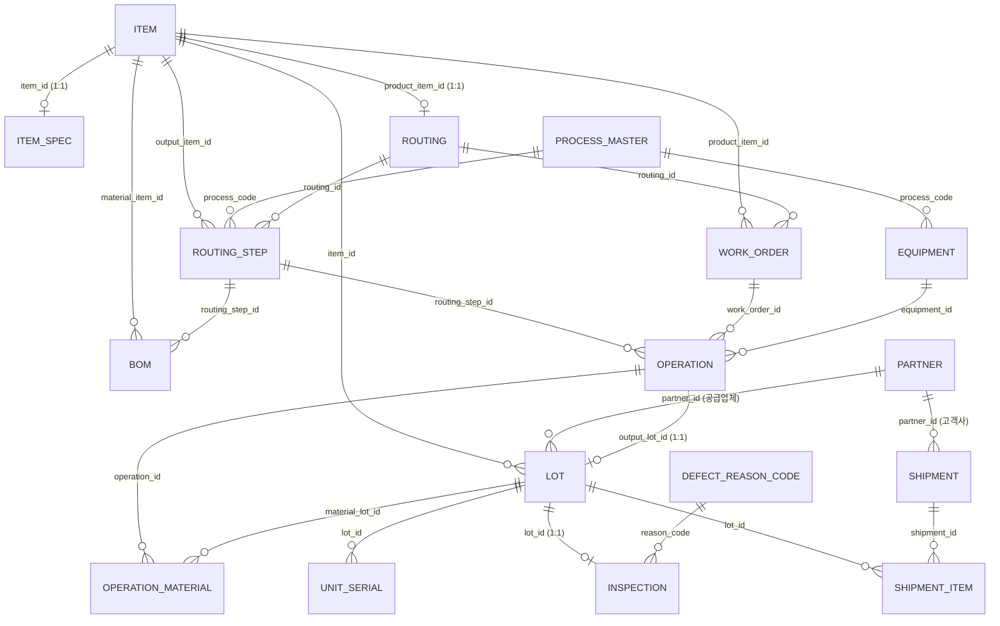

# Auto Parts MES (자동차부품 생산관리시스템)

> 다단계 공정(라우팅)과 개별 부품 시리얼 추적이 가능한 MES를 Python + Streamlit + SQLite로 직접 설계·구현한 프로젝트입니다.

<!-- 
📌 여기에 스크린샷 또는 GIF 삽입 (필수 — 채용담당자가 클릭 안 해도 3초 안에 뭘 만들었는지 보이게)
예: 
🔗 실행 중인 데모 링크가 있다면 여기에 (Streamlit Community Cloud 등)
예: **[▶ 라이브 데모 바로가기](여기에 URL)**
-->

---

## 1. 프로젝트 개요

자동차부품 제조 공정을 관리하는 생산관리시스템(MES)입니다. 이전에 만든 "라면공장 Mini MES"의 핵심 구조(품목-LOT-생산-검사-출하)를 재사용하되, 자동차부품 업종 특성에 맞춰 **다단계 공정(라우팅) 관리**와 **개별 부품 시리얼 추적** 기능을 추가로 설계·구현했습니다.

**기술 스택**
- Frontend/App: Python, Streamlit
- Database: SQLite
- 인증: 아이디/비밀번호 해시(SHA-256) 기반, 역할별(ADMIN/OPERATOR/INSPECTOR) 접근 제어

---

## 2. 문제 정의 — 왜 이 구조로 설계했는가

자동차부품은 라면 같은 단일 공정 제품과 달리, 실무에서 다음과 같은 요구사항이 추가로 필요합니다.

- "이 부품은 프레스 → 용접 → 도장을 거치는데, 지금 어느 단계까지 진행됐지?"
- "이 원자재 로트에 문제가 생겼는데, 어떤 완제품(그리고 몇 번 시리얼)까지 영향을 미쳤지?"
- "이 도면번호/재질규격에 맞게 만들어졌는지 스펙을 어디서 확인하지?"
- "완성차 업체가 특정 부품 하나의 이력(전 공정, 전 원자재)을 요구하면 어떻게 답하지?"

단일 공정 구조로는 이런 질문에 답할 수 없었기 때문에, **공정 순서(라우팅)** 와 **개별 시리얼 추적**이 가능한 구조로 새로 설계했습니다.

---

## 3. 시스템 구조

**핵심 데이터 흐름**

```
품목/거래처/공정/설비 등록 → 라우팅·BOM 설계 → 원자재 입고
    → 작업지시 → 공정 실행(단계별 반복) → 검사 → 개별 시리얼 부여 → 출하 → LOT 추적
```

기존 라면 MES와의 가장 큰 차이는 "생산"이 한 번에 끝나지 않고 **공정 단계 수만큼 반복**된다는 점입니다.

### 3-1. ERD

<!-- 📌 ERD 다이어그램 이미지로 렌더링해서 삽입 권장 (mermaid 코드 캡처 or 별도 툴로 그리기) -->



### 3-2. 역할별 접근 권한

| 페이지 | ADMIN | OPERATOR | INSPECTOR |
|---|---|---|---|
| 품목 관리 | ✅ | ✅ | ✅ (조회 위주) |
| 거래처 관리 | ✅ | ✅ | ❌ |
| 공정/설비 관리 | ✅ | ✅ | ❌ |
| 라우팅/BOM 관리 | ✅ | ✅ | ❌ |
| 원자재 입고 | ✅ | ✅ | ❌ |
| 작업지시 | ✅ | ✅ | ❌ |
| 공정 실행 | ✅ | ✅ | ❌ |
| 검사 관리 | ✅ | ❌ | ✅ |
| 개별 시리얼 관리 | ✅ | ✅ | ✅ |
| 출하 관리 | ✅ | ✅ | ❌ |
| LOT 추적 | ✅ | ✅ | ✅ |
| 사용자 관리 | ✅ | ❌ | ❌ |

---

## 4. 핵심 기능

| 기능 | 설명 |
|---|---|
| **라우팅/BOM 관리** | 제품이 거칠 공정 순서를 단계별로 등록(예: 1.프레스→2.용접→3.도장), 각 단계별 필요 원자재를 BOM으로 연결 |
| **공정 실행** | 작업지시를 고르면 다음에 실행할 단계가 자동 계산되어 표시. 단계 건너뛰기는 시스템이 차단 |
| **개별 시리얼 관리** | LOT 단위 추적으로 부족한 안전부품 등을 위해 부품 하나하나에 시리얼번호 부여 |
| **LOT 추적** | 원자재 LOT 하나를 정방향 추적하면 전체 공정을 거쳐 어떤 완제품이 됐고 어디로 출하됐는지 한 번에 조회. SQLite `WITH RECURSIVE` 재귀 쿼리로 구현 |
| **출하 관리** | 완제품 LOT만 대상, 불합격(FAIL) 판정 LOT는 자동으로 출하 차단 |
| **홈 대시보드** | 작업지시별 진행률, 원자재 재고 알림, 최근 활동 타임라인 |

---

## 5. 담당 역할

<!-- 📌 팀 프로젝트라면 필수로 채워야 하는 섹션입니다. 예시 형태만 남겨두었으니 실제로 본인이 한 부분으로 교체해주세요 -->

- (예: ERD 및 테이블 스키마 설계)
- (예: 공정 실행 로직 — 다음 단계 자동 계산 및 단계 스킵 방지 구현)
- (예: LOT 추적 재귀 쿼리 작성)
- (예: 역할별(ADMIN/OPERATOR/INSPECTOR) 접근 제어 구현)

---

## 6. 기술적으로 고민했던 지점

> 발표 때 준비했던 Q&A를 "고민 과정"으로 재구성한 부분입니다. 실제 인터뷰에서도 그대로 쓰기 좋습니다.

**왜 SQLite를 선택했는가**
소규모 시스템이라 별도 서버 없이 파일 하나로 관리 가능하다는 점을 고려했습니다. 실제 운영 규모라면 PostgreSQL 등으로 전환할 수 있는 구조로 설계했습니다.

**라면공장 MES 대비 가장 큰 구조 변화**
생산이 한 번에 끝나지 않고 공정 단계(라우팅) 수만큼 반복되는 점입니다. 그래서 `production` 테이블 하나였던 것을 `routing` / `routing_step` / `work_order` / `operation` 네 개로 분리했습니다.

**BOM을 제품이 아닌 공정 단계에 연결한 이유**
원자재가 "제품 전체"가 아니라 "몇 번째 공정에서" 투입되는지가 중요했기 때문입니다. 1단계에서 강판이 들어가고 3단계에서 도료가 들어가는 식으로 공정별 투입 자재가 다릅니다.

**LOT 추적을 재귀 쿼리로 구현한 이유**
공정 단계 수가 제품마다 다를 수 있어서, 몇 단계든 자동으로 끝까지 따라가려면 SQL의 `WITH RECURSIVE` 재귀 쿼리가 필요했습니다.

**보안 처리**
비밀번호는 평문 저장 없이 솔트+SHA-256 해시로 저장하고, 역할(ADMIN/OPERATOR/INSPECTOR)에 따라 페이지 접근을 제한했습니다.

---

## 7. 확장 가능성

이 구조는 라면공장 MES에서 시작해, 다단계 공정과 개별 시리얼 추적이 필요한 업종(자동차부품, 전자부품 등)에 맞게 확장한 결과입니다. 반대로 라우팅이 항상 1단계인 업종에서는 라면 MES 쪽 구조가 더 단순하고 적합합니다. 즉 업종 특성에 따라 두 구조 중 선택하거나, 필요할 때 라우팅을 도입하는 방식으로 점진적 전환이 가능합니다.

---

## 8. 실행 방법

<!-- 📌 실제 실행 명령어로 교체해주세요 -->

```bash
git clone https://github.com/t01048101606-sys/AutoParts-MES-Arduino.git
cd AutoParts-MES-Arduino
pip install -r requirements.txt   # requirements.txt가 없다면 추가 필요
python seed_admin.py              # 관리자 계정 초기 세팅
streamlit run app.py
```

---

## 폴더 구조

```
├── doc/         # 문서
├── pages/       # Streamlit 페이지별 화면
├── sql/         # DB 스키마/쿼리
├── src/         # 소스 코드
├── app.py       # 메인 앱 진입점
├── arduino.ino  # 아두이노 연동 코드
├── sender.py    # 데이터 전송 스크립트
└── seed_admin.py # 관리자 계정 초기 세팅
```
